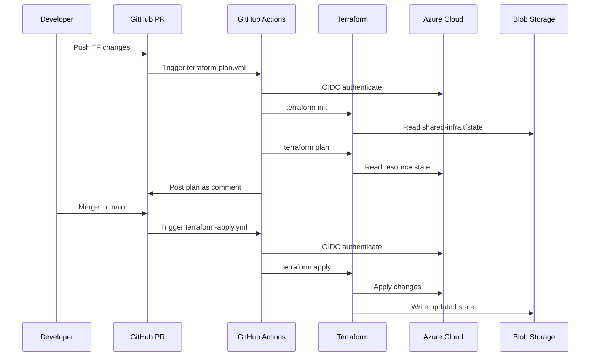

# Design: Consolidate Shared Infrastructure

## Overview

Consolidate shared Azure resources (RG, KV, ACR, AKS, OIDC, Workload Identity) from yt-summarizer into a single Terraform root module in shared-infra, using `removed`/`import` blocks for zero-downtime state migration. Simultaneously centralize 53 GitHub Actions composite actions and reusable workflows from both consumer repos, referenced via `AshleyHollis/shared-infra/.github/actions/<name>@v1`.

> **Note (action count)**: Requirements specify 48 actions throughout (Goal, US-8, FR-6); actual verified count is 53 per codebase analysis (see .progress.md). This design uses the verified count of 53.

> **Note (DNS zone -- AC-3.1)**: Requirements list "DNS zone" in AC-3.1, AC-4.1, AC-5.2, and FR-1. However, no `azurerm_dns_zone` or equivalent resource exists in yt-summarizer's Terraform code. The only DNS references are the AKS `dns_prefix` parameter (part of the AKS resource, not a standalone zone) and a Cloudflare API token variable. DNS zone is **deferred** -- there is no existing resource to migrate. If a DNS zone is created in the future, it can be added to this root module with no architectural changes.

## Architecture

```mermaid
graph TB
    subgraph SharedInfra["shared-infra repo"]
        direction TB
        TF["terraform/\n(root module)"]
        Modules["terraform/modules/\naks, acr, kv, github-oidc"]
        DataMod["terraform/modules/\nshared-infra-data"]
        Actions[".github/actions/\n53 composite actions"]
        Workflows[".github/workflows/\nreusable + internal CI"]

        TF --> Modules
    end

    subgraph Azure["Azure"]
        State["Blob Storage\nstytsummarizertfstate\nkey: shared-infra.tfstate"]
        RG["rg-ytsumm-prd"]
        AKS["aks-ytsumm-prd"]
        ACR["acrytsummprd"]
        KV["kv-ytsumm-prd"]
        OIDC["Azure AD App\n+ Federated Creds"]
        WI["Managed Identity\nid-ytsumm-prd-eso"]
    end

    subgraph Consumers["Consumer Repos"]
        YT["yt-summarizer\n(app-specific TF)"]
        MP["meal-planner\n(app-specific TF)"]
    end

    TF -->|"writes state"| State
    TF -->|"manages"| RG & AKS & ACR & KV & OIDC & WI

    YT -->|"terraform_remote_state\nvia shared-infra-data module"| State
    MP -->|"terraform_remote_state\nvia shared-infra-data module"| State

    YT -->|"uses actions @v1"| Actions
    MP -->|"uses actions @v1"| Actions
    YT -->|"calls workflows"| Workflows
    MP -->|"calls workflows"| Workflows
```



## Directory Structure

```
shared-infra/
+-- terraform/
|   +-- main.tf                    # Resource group + module calls
|   +-- aks.tf                     # AKS module call
|   +-- acr.tf                     # ACR module call
|   +-- key-vault.tf               # Key Vault module call (no secrets)
|   +-- github-oidc.tf             # OIDC module call
|   +-- workload-identity.tf       # Managed identity + federated cred
|   +-- backend.tf                 # azurerm backend config
|   +-- providers.tf               # azurerm + azuread providers
|   +-- versions.tf                # terraform + provider constraints
|   +-- variables.tf               # Input variables
|   +-- outputs.tf                 # Stable API contract
|   +-- locals.tf                  # Shared locals
|   +-- terraform.auto.tfvars      # Non-sensitive defaults
|   +-- .terraform.lock.hcl        # Provider lock file
|   +-- modules/
|   |   +-- aks/main.tf            # Copied from yt-summarizer
|   |   +-- container-registry/main.tf
|   |   +-- github-oidc/           # main.tf, outputs.tf, variables.tf
|   |   +-- key-vault/main.tf
|   |   +-- shared-infra-data/     # NEW: data-only consumer module
|   |       +-- main.tf
|   |       +-- outputs.tf
|   |       +-- variables.tf
+-- .github/
|   +-- actions/                   # 53 composite actions
|   |   +-- argocd-wait/action.yml
|   |   +-- azure-acr-login/action.yml
|   |   +-- build-images/action.yml
|   |   +-- ... (50 more)
|   +-- workflows/
|       +-- terraform-plan.yml         # Internal: plan on PR
|       +-- terraform-apply.yml        # Internal: apply on merge
|       +-- actionlint.yml             # Internal: lint actions/workflows
|       +-- terraform-reusable.yml     # Reusable: plan + apply
|       +-- build-and-push.yml         # Reusable: container build + ACR push
|       +-- deploy-to-aks.yml          # Reusable: AKS deployment
+-- scripts/
|   +-- bootstrap-backend.sh       # One-time state backend setup
+-- specs/                         # Spec artifacts
+-- CHANGELOG.md
```

## Components

### 1. Terraform Root Module

**Purpose**: Single `terraform apply` manages all shared Azure resources.

**Resources managed** (via modules + inline):

| Resource | Address | Source |
|----------|---------|--------|
| Resource Group | `azurerm_resource_group.main` | Inline |
| AKS Cluster | `module.aks` | `modules/aks` |
| Container Registry | `module.acr` | `modules/container-registry` |
| Key Vault | `module.key_vault` | `modules/key-vault` |
| GitHub OIDC App | `module.github_oidc` | `modules/github-oidc` |
| Managed Identity (ESO) | `azurerm_user_assigned_identity.external_secrets` | Inline |
| Federated Credential (ESO) | `azurerm_federated_identity_credential.external_secrets` | Inline |
| KV Role Assignment (ESO) | `azurerm_role_assignment.external_secrets_kv_reader` | Inline |

**Key differences from yt-summarizer**: No secrets in Key Vault (secrets are app-specific), no SQL/Storage/SWA/ArgoCD/Auth0 resources, fewer variables.

**`terraform/backend.tf`**:
```hcl
terraform {
  backend "azurerm" {
    resource_group_name  = "rg-ytsummarizer-tfstate"
    storage_account_name = "stytsummarizertfstate"
    container_name       = "tfstate"
    key                  = "shared-infra.tfstate"
    use_oidc             = true
  }
}
```

**`terraform/versions.tf`**:
```hcl
terraform {
  required_version = ">= 1.7.0"

  required_providers {
    azurerm = {
      source  = "hashicorp/azurerm"
      version = ">= 4.57.0, < 5.0"
    }
    azuread = {
      source  = "hashicorp/azuread"
      version = ">= 3.7.0"
    }
  }
}
```

**`terraform/locals.tf`**:
```hcl
locals {
  name_prefix = "ytsumm-prd"

  common_tags = {
    Environment = "prod"
    Project     = "shared-infra"
    ManagedBy   = "terraform"
  }
}
```

**`terraform/variables.tf`** (only shared-infra-relevant vars):
```hcl
variable "subscription_id" {
  description = "Azure subscription ID"
  type        = string
}

variable "location" {
  description = "Azure region for resources"
  type        = string
  default     = "eastasia"
}

variable "kubernetes_version" {
  description = "Kubernetes version for AKS"
  type        = string
  default     = "1.33"
}

variable "aks_node_size" {
  description = "VM size for AKS nodes"
  type        = string
  default     = "Standard_B4als_v2"
}

variable "aks_os_disk_size_gb" {
  description = "OS disk size for AKS nodes in GB"
  type        = number
  default     = 128
}

variable "acr_sku" {
  description = "SKU for Azure Container Registry"
  type        = string
  default     = "Basic"
}

variable "key_vault_secrets_officer_principal_id" {
  description = "Principal ID with Key Vault Secrets Officer access"
  type        = string
  default     = "eac9556a-cd81-431f-a1ec-d6940b2d92d3"
}
```

**`terraform/main.tf`** (resource group only):
```hcl
resource "azurerm_resource_group" "main" {
  name     = "rg-${local.name_prefix}"
  location = var.location
  tags     = local.common_tags

  lifecycle {
    prevent_destroy = true
  }
}
```

**`terraform/aks.tf`**:
```hcl
module "aks" {
  source = "./modules/aks"

  name                = "aks-${local.name_prefix}"
  resource_group_name = azurerm_resource_group.main.name
  location            = azurerm_resource_group.main.location
  dns_prefix          = local.name_prefix
  kubernetes_version  = var.kubernetes_version

  node_count      = 1
  node_vm_size    = var.aks_node_size
  node_pool_name  = "system2"
  os_disk_size_gb = var.aks_os_disk_size_gb

  enable_workload_identity = true

  tags = local.common_tags

  lifecycle {
    prevent_destroy = true
  }
}
```

**`terraform/acr.tf`**:
```hcl
module "acr" {
  source = "./modules/container-registry"

  name                = replace("acr${local.name_prefix}", "-", "")
  resource_group_name = azurerm_resource_group.main.name
  location            = azurerm_resource_group.main.location
  sku                 = var.acr_sku

  tags = local.common_tags

  lifecycle {
    prevent_destroy = true
  }
}
```

**`terraform/key-vault.tf`** (no secrets -- secrets are app-specific):
```hcl
module "key_vault" {
  source = "./modules/key-vault"

  name                         = "kv-${local.name_prefix}"
  resource_group_name          = azurerm_resource_group.main.name
  location                     = azurerm_resource_group.main.location
  purge_protection_enabled     = true
  secrets_officer_principal_id = var.key_vault_secrets_officer_principal_id

  secrets = {}

  tags = local.common_tags

  lifecycle {
    prevent_destroy = true
  }
}
```

**`terraform/github-oidc.tf`** (multi-repo federated credentials):
```hcl
module "github_oidc" {
  source = "./modules/github-oidc"

  github_organization     = "AshleyHollis"
  github_repository       = "shared-infra"
  assign_contributor_role = true
  acr_id                  = module.acr.id

  tags = local.common_tags
}
```

**`terraform/workload-identity.tf`**:
```hcl
resource "azurerm_user_assigned_identity" "external_secrets" {
  name                = "id-${local.name_prefix}-eso"
  location            = azurerm_resource_group.main.location
  resource_group_name = azurerm_resource_group.main.name
  tags                = local.common_tags
}

resource "azurerm_federated_identity_credential" "external_secrets" {
  name                = "fedcred-${local.name_prefix}-eso"
  resource_group_name = azurerm_resource_group.main.name
  parent_id           = azurerm_user_assigned_identity.external_secrets.id
  audience            = ["api://AzureADTokenExchange"]
  issuer              = module.aks.oidc_issuer_url
  subject             = "system:serviceaccount:yt-summarizer:yt-summarizer-sa"
}

resource "azurerm_role_assignment" "external_secrets_kv_reader" {
  scope                = module.key_vault.id
  role_definition_name = "Key Vault Secrets User"
  principal_id         = azurerm_user_assigned_identity.external_secrets.principal_id
}
```

**`terraform/outputs.tf`** (stable API -- no sensitive values):
```hcl
output "resource_group_name" {
  description = "Name of the shared resource group"
  value       = azurerm_resource_group.main.name
}

output "resource_group_id" {
  description = "ID of the shared resource group"
  value       = azurerm_resource_group.main.id
}

output "resource_group_location" {
  description = "Location of the shared resource group"
  value       = azurerm_resource_group.main.location
}

output "key_vault_name" {
  description = "Name of the shared Key Vault"
  value       = module.key_vault.name
}

output "key_vault_id" {
  description = "ID of the shared Key Vault"
  value       = module.key_vault.id
}

output "key_vault_uri" {
  description = "URI of the shared Key Vault"
  value       = module.key_vault.vault_uri
}

output "key_vault_tenant_id" {
  description = "Tenant ID of the shared Key Vault"
  value       = module.key_vault.tenant_id
}

output "acr_name" {
  description = "Name of the Azure Container Registry"
  value       = module.acr.name
}

output "acr_login_server" {
  description = "Login server URL for the Azure Container Registry"
  value       = module.acr.login_server
}

output "acr_id" {
  description = "ID of the Azure Container Registry"
  value       = module.acr.id
}

output "aks_cluster_name" {
  description = "Name of the AKS cluster"
  value       = module.aks.name
}

output "aks_cluster_id" {
  description = "ID of the AKS cluster"
  value       = module.aks.id
}

output "aks_fqdn" {
  description = "FQDN of the AKS cluster"
  value       = module.aks.fqdn
}

output "aks_oidc_issuer_url" {
  description = "OIDC issuer URL for Workload Identity federation"
  value       = module.aks.oidc_issuer_url
}

output "aks_kubelet_identity_object_id" {
  description = "Object ID of the AKS kubelet managed identity"
  value       = module.aks.kubelet_identity_object_id
}

output "github_oidc_application_id" {
  description = "Azure AD Application (Client) ID for AZURE_CLIENT_ID"
  value       = module.github_oidc.application_id
}

output "github_oidc_tenant_id" {
  description = "Azure AD Tenant ID for AZURE_TENANT_ID"
  value       = module.github_oidc.tenant_id
}

output "github_oidc_subscription_id" {
  description = "Azure Subscription ID for AZURE_SUBSCRIPTION_ID"
  value       = module.github_oidc.subscription_id
}

output "workload_identity_client_id" {
  description = "Client ID for External Secrets Workload Identity"
  value       = azurerm_user_assigned_identity.external_secrets.client_id
}
```

### 2. Data-Only Consumer Module

**Purpose**: Wrap `terraform_remote_state` so consumers don't hardcode backend config.

**`terraform/modules/shared-infra-data/main.tf`**:
```hcl
data "terraform_remote_state" "shared_infra" {
  backend = "azurerm"

  config = {
    resource_group_name  = "rg-ytsummarizer-tfstate"
    storage_account_name = "stytsummarizertfstate"
    container_name       = "tfstate"
    key                  = "shared-infra.tfstate"
    use_oidc             = true
  }
}
```

**`terraform/modules/shared-infra-data/outputs.tf`** (re-exports all shared-infra outputs):
```hcl
output "resource_group_name" {
  description = "Name of the shared resource group"
  value       = data.terraform_remote_state.shared_infra.outputs.resource_group_name
}

output "resource_group_id" {
  description = "ID of the shared resource group"
  value       = data.terraform_remote_state.shared_infra.outputs.resource_group_id
}

output "resource_group_location" {
  description = "Location of the shared resource group"
  value       = data.terraform_remote_state.shared_infra.outputs.resource_group_location
}

output "key_vault_name" {
  value = data.terraform_remote_state.shared_infra.outputs.key_vault_name
}

output "key_vault_id" {
  value = data.terraform_remote_state.shared_infra.outputs.key_vault_id
}

output "key_vault_uri" {
  value = data.terraform_remote_state.shared_infra.outputs.key_vault_uri
}

output "key_vault_tenant_id" {
  value = data.terraform_remote_state.shared_infra.outputs.key_vault_tenant_id
}

output "acr_name" {
  value = data.terraform_remote_state.shared_infra.outputs.acr_name
}

output "acr_login_server" {
  value = data.terraform_remote_state.shared_infra.outputs.acr_login_server
}

output "acr_id" {
  value = data.terraform_remote_state.shared_infra.outputs.acr_id
}

output "aks_cluster_name" {
  value = data.terraform_remote_state.shared_infra.outputs.aks_cluster_name
}

output "aks_cluster_id" {
  value = data.terraform_remote_state.shared_infra.outputs.aks_cluster_id
}

output "aks_fqdn" {
  value = data.terraform_remote_state.shared_infra.outputs.aks_fqdn
}

output "aks_oidc_issuer_url" {
  value = data.terraform_remote_state.shared_infra.outputs.aks_oidc_issuer_url
}

output "aks_kubelet_identity_object_id" {
  value = data.terraform_remote_state.shared_infra.outputs.aks_kubelet_identity_object_id
}

output "github_oidc_application_id" {
  value = data.terraform_remote_state.shared_infra.outputs.github_oidc_application_id
}

output "github_oidc_tenant_id" {
  value = data.terraform_remote_state.shared_infra.outputs.github_oidc_tenant_id
}

output "github_oidc_subscription_id" {
  value = data.terraform_remote_state.shared_infra.outputs.github_oidc_subscription_id
}

output "workload_identity_client_id" {
  value = data.terraform_remote_state.shared_infra.outputs.workload_identity_client_id
}
```

**Consumer usage** (in yt-summarizer or meal-planner):
```hcl
module "shared" {
  source = "git::https://github.com/AshleyHollis/shared-infra.git//terraform/modules/shared-infra-data?ref=v1"
}

# Then reference: module.shared.resource_group_name, module.shared.key_vault_name, etc.
```

### 3. GitHub Actions (53 Composite Actions)

**Purpose**: Centralize all composite actions; consumers reference `AshleyHollis/shared-infra/.github/actions/<name>@v1`.

**Critical change**: Actions that currently use `./.github/actions/<dependency>` for cross-action references must be updated to use `AshleyHollis/shared-infra/.github/actions/<dependency>@v1`.

**Action requiring update -- `setup-terraform-azure`**:
```yaml
# BEFORE (in yt-summarizer): uses local reference
- uses: ./.github/actions/verify-azure-credentials

# AFTER (in shared-infra): uses absolute reference
- uses: AshleyHollis/shared-infra/.github/actions/verify-azure-credentials@v1
```

**Actions with cross-action dependencies** (must update internal `uses:` references):

| Action | Depends On |
|--------|-----------|
| `setup-terraform-azure` | `verify-azure-credentials` |

All other actions are self-contained (use only marketplace actions or shell scripts).

**Complete action list** (53 actions):

| # | Action Name | Category |
|---|-------------|----------|
| 1 | argocd-wait | Deployment |
| 2 | azure-acr-login | Azure Auth |
| 3 | build-images | Build |
| 4 | check-pr-open | PR Util |
| 5 | check-preview-concurrency | Preview |
| 6 | check-preview-status | Preview |
| 7 | cleanup-acr-images | Cleanup |
| 8 | cleanup-stale-swa-environments | Cleanup |
| 9 | close-swa-environment | SWA |
| 10 | collect-deployment-diagnostics | Debug |
| 11 | compute-preview-urls | Preview |
| 12 | create-pipeline-summary | CI |
| 13 | deploy-frontend-swa | SWA |
| 14 | deployment-validate | Validation |
| 15 | detect-pr-code-changes | PR Util |
| 16 | generate-image-tag | Build |
| 17 | get-pr-metadata | PR Util |
| 18 | health-check | Deployment |
| 19 | health-check-preview | Preview |
| 20 | load-shared-env | Env |
| 21 | manage-kustomization | K8s |
| 22 | post-e2e-results | Testing |
| 23 | post-preview-comment | Preview |
| 24 | post-terraform-plan | Terraform |
| 25 | prepare-swa-deployment | SWA |
| 26 | publish-image-tag | Build |
| 27 | record-test-duration | Testing |
| 28 | run-frontend-tests | Testing |
| 29 | run-playwright-tests | Testing |
| 30 | run-pytest | Testing |
| 31 | run-python-tests | Testing |
| 32 | run-ruff-check | Linting |
| 33 | scan-javascript-dependencies | Security |
| 34 | scan-python-security | Security |
| 35 | setup-aks | K8s |
| 36 | setup-azure-acr | Azure |
| 37 | setup-azure-aks | Azure |
| 38 | setup-deployment-env | Deployment |
| 39 | setup-kustomize | K8s |
| 40 | setup-node | Setup |
| 41 | setup-python-env | Setup |
| 42 | setup-terraform-azure | Setup |
| 43 | sync-argocd-manifests | Deployment |
| 44 | terraform-plan | Terraform |
| 45 | validate | Validation |
| 46 | validate-ci-results | CI |
| 47 | validate-docker-image | Build |
| 48 | validate-python-dependencies | Security |
| 49 | verify-azure-credentials | Azure Auth |
| 50 | verify-certificate | Security |
| 51 | verify-k8s-deployment | Deployment |
| 52 | verify-secret | Security |
| 53 | wait-for-ci | CI |

### 4. Reusable Workflows

**`terraform-reusable.yml`** -- Plan + Apply workflow (adapted from yt-summarizer's existing reusable workflow). Simplified for shared-infra context (fewer secrets needed -- no Auth0, no SQL, no OpenAI).

Shared-infra's internal version needs only Azure OIDC secrets. The consumer-facing version retains the full secret interface from yt-summarizer.

| Workflow | Trigger | Purpose |
|----------|---------|---------|
| `terraform-plan.yml` | `pull_request` paths `terraform/**` | Internal: plan on PR, post comment |
| `terraform-apply.yml` | `push` to `main` paths `terraform/**` | Internal: apply on merge |
| `actionlint.yml` | `pull_request` paths `.github/**` | Internal: lint actions + workflows |
| `terraform-reusable.yml` | `workflow_call` | Reusable: TF plan/apply for consumers |
| `build-and-push.yml` | `workflow_call` | Reusable: docker build + ACR push |
| `deploy-to-aks.yml` | `workflow_call` | Reusable: AKS deployment via ArgoCD |

**Internal CI: `terraform-plan.yml`**:
```yaml
name: Terraform Plan
on:
  pull_request:
    branches: [main]
    paths:
      - 'terraform/**'
      - '.github/workflows/terraform-plan.yml'

permissions:
  id-token: write
  contents: read
  pull-requests: write

jobs:
  plan:
    runs-on: ubuntu-latest
    env:
      ARM_CLIENT_ID: ${{ secrets.AZURE_CLIENT_ID }}
      ARM_TENANT_ID: ${{ secrets.AZURE_TENANT_ID }}
      ARM_SUBSCRIPTION_ID: ${{ secrets.AZURE_SUBSCRIPTION_ID }}
      ARM_USE_OIDC: true
    steps:
      - uses: actions/checkout@v4
      - uses: hashicorp/setup-terraform@v3
        with:
          terraform_version: "1.7"
      - uses: azure/login@v2
        with:
          client-id: ${{ secrets.AZURE_CLIENT_ID }}
          tenant-id: ${{ secrets.AZURE_TENANT_ID }}
          subscription-id: ${{ secrets.AZURE_SUBSCRIPTION_ID }}
      - name: Terraform Init
        working-directory: terraform
        run: terraform init -input=false -no-color
      - name: Terraform Validate
        working-directory: terraform
        run: terraform validate
      - name: Terraform Format Check
        working-directory: terraform
        run: terraform fmt -check -recursive
      - name: Terraform Plan
        working-directory: terraform
        run: terraform plan -input=false -no-color
        # TODO: Post plan output as PR comment (use post-terraform-plan action)
```

**Internal CI: `terraform-apply.yml`**:
```yaml
name: Terraform Apply
on:
  push:
    branches: [main]
    paths:
      - 'terraform/**'

permissions:
  id-token: write
  contents: read

jobs:
  apply:
    runs-on: ubuntu-latest
    environment: production
    env:
      ARM_CLIENT_ID: ${{ secrets.AZURE_CLIENT_ID }}
      ARM_TENANT_ID: ${{ secrets.AZURE_TENANT_ID }}
      ARM_SUBSCRIPTION_ID: ${{ secrets.AZURE_SUBSCRIPTION_ID }}
      ARM_USE_OIDC: true
    steps:
      - uses: actions/checkout@v4
      - uses: hashicorp/setup-terraform@v3
        with:
          terraform_version: "1.7"
      - uses: azure/login@v2
        with:
          client-id: ${{ secrets.AZURE_CLIENT_ID }}
          tenant-id: ${{ secrets.AZURE_TENANT_ID }}
          subscription-id: ${{ secrets.AZURE_SUBSCRIPTION_ID }}
      - name: Terraform Init
        working-directory: terraform
        run: terraform init -input=false -no-color
      - name: Terraform Plan (detect destroy)
        working-directory: terraform
        run: |
          terraform plan -input=false -no-color -detailed-exitcode -out=tfplan 2>&1 || EXIT_CODE=$?
          if [ "${EXIT_CODE}" = "1" ]; then
            echo "::error::Terraform plan failed"
            exit 1
          fi
          # Check for destructive changes
          if terraform show -json tfplan | jq -e '.resource_changes[] | select(.change.actions[] == "delete")' > /dev/null 2>&1; then
            echo "::error::Plan contains resource destruction. Manual override required."
            exit 1
          fi
      - name: Terraform Apply
        working-directory: terraform
        run: terraform apply -auto-approve tfplan
```

### 5. OIDC Authentication Design

**Decision**: Create a NEW Azure AD app registration for shared-infra (not reuse yt-summarizer's).

**Rationale**: The github-oidc module creates federated credentials scoped to a specific repo (`repo:AshleyHollis/shared-infra:ref:refs/heads/main`). Reusing yt-summarizer's app would require adding credentials for shared-infra repo while keeping yt-summarizer's credentials -- more complex than a fresh app with Contributor role.

**yt-summarizer's existing OIDC app** remains for yt-summarizer-specific workflows. Shared-infra's OIDC app gets Contributor role at subscription level (via `assign_contributor_role = true`) plus AcrPush on the ACR.

**Bootstrap order**: The OIDC app for shared-infra must be created manually first (chicken-and-egg), then imported into state. Alternatively, run initial `terraform apply` with Azure CLI auth, which creates the OIDC app, then switch to OIDC auth for subsequent runs.

## Data Flow



## State Migration Plan

### Pre-Migration

1. Back up yt-summarizer state: `cd yt-summarizer/infra/terraform/environments/prod && terraform state pull > backup-pre-migration.tfstate`
2. Document all resource IDs: `az resource list -g rg-ytsumm-prd --query "[].{name:name, id:id, type:type}" -o table`
3. Ensure shared-infra `terraform init` succeeds with empty state

### Batch 1: Resource Group

**In shared-infra** -- add import block to `terraform/main.tf`:
```hcl
import {
  to = azurerm_resource_group.main
  id = "/subscriptions/28aefbe7-e2af-4b4a-9ce1-92d6672c31bd/resourceGroups/rg-ytsumm-prd"
}
```

**In yt-summarizer** -- add removed block to `environments/prod/resource-group.tf`:
```hcl
removed {
  from = azurerm_resource_group.main

  lifecycle {
    destroy = false
  }
}
```

**Validation**:
1. `terraform plan` in shared-infra: expect import, no changes to resource
2. `terraform apply` in shared-infra: import executes
3. Remove import block from shared-infra (one-time)
4. `terraform plan` in shared-infra: no changes
5. `terraform plan` in yt-summarizer: shows removed (no destroy)
6. `terraform apply` in yt-summarizer: removes from state

### Batch 2: Key Vault + ACR

**In shared-infra** -- add import blocks:
```hcl
import {
  to = module.key_vault.azurerm_key_vault.vault
  id = "/subscriptions/28aefbe7-e2af-4b4a-9ce1-92d6672c31bd/resourceGroups/rg-ytsumm-prd/providers/Microsoft.KeyVault/vaults/kv-ytsumm-prd"
}

import {
  to = module.key_vault.azurerm_role_assignment.secrets_officer[0]
  id = "<role-assignment-id>"  # Get via: az role assignment list --scope <kv-id> --query "[?roleDefinitionName=='Key Vault Secrets Officer'].id" -o tsv
}

import {
  to = module.acr.azurerm_container_registry.acr
  id = "/subscriptions/28aefbe7-e2af-4b4a-9ce1-92d6672c31bd/resourceGroups/rg-ytsumm-prd/providers/Microsoft.ContainerRegistry/registries/acrytsummprd"
}
```

**In yt-summarizer** -- add removed blocks:
```hcl
removed {
  from = module.key_vault.azurerm_key_vault.vault
  lifecycle { destroy = false }
}

removed {
  from = module.key_vault.azurerm_role_assignment.secrets_officer[0]
  lifecycle { destroy = false }
}

removed {
  from = module.acr.azurerm_container_registry.acr
  lifecycle { destroy = false }
}
```

**Important**: Key Vault secrets (`module.key_vault.azurerm_key_vault_secret.secrets[*]`) stay in yt-summarizer because they are app-specific (sql-connection-string, storage-connection, openai-api-key, etc.). The `key_vault` module call in yt-summarizer must be modified to reference the KV by data source instead of creating it.

**Validation**: Same pattern as Batch 1. Back up state before each batch.

### Batch 3: AKS + Workload Identity + OIDC

**In shared-infra** -- add import blocks:
```hcl
import {
  to = module.aks.azurerm_kubernetes_cluster.aks
  id = "/subscriptions/28aefbe7-e2af-4b4a-9ce1-92d6672c31bd/resourceGroups/rg-ytsumm-prd/providers/Microsoft.ContainerService/managedClusters/aks-ytsumm-prd"
}

import {
  to = azurerm_user_assigned_identity.external_secrets
  id = "/subscriptions/28aefbe7-e2af-4b4a-9ce1-92d6672c31bd/resourceGroups/rg-ytsumm-prd/providers/Microsoft.ManagedIdentity/userAssignedIdentities/id-ytsumm-prd-eso"
}

import {
  to = azurerm_federated_identity_credential.external_secrets
  id = "/subscriptions/28aefbe7-e2af-4b4a-9ce1-92d6672c31bd/resourceGroups/rg-ytsumm-prd/providers/Microsoft.ManagedIdentity/userAssignedIdentities/id-ytsumm-prd-eso/federatedIdentityCredentials/fedcred-ytsumm-prd-eso"
}

import {
  to = azurerm_role_assignment.external_secrets_kv_reader
  id = "<role-assignment-id>"  # Get via az role assignment list
}
```

**Note on OIDC**: The existing `module.github_oidc` in yt-summarizer creates an Azure AD app for yt-summarizer repo. shared-infra creates a NEW app for shared-infra repo. The yt-summarizer OIDC app stays in yt-summarizer's state -- it is NOT migrated.

**In yt-summarizer** -- add removed blocks for AKS and workload identity:
```hcl
removed {
  from = module.aks.azurerm_kubernetes_cluster.aks
  lifecycle { destroy = false }
}

removed {
  from = azurerm_user_assigned_identity.external_secrets
  lifecycle { destroy = false }
}

removed {
  from = azurerm_federated_identity_credential.external_secrets
  lifecycle { destroy = false }
}

removed {
  from = azurerm_role_assignment.external_secrets_kv_reader
  lifecycle { destroy = false }
}
```

**Validation**: Same pattern. After batch 3, `terraform plan` in both repos should show zero changes (except removed blocks in yt-summarizer showing "will be removed from state").

### Post-Migration Cleanup

1. Remove all `import` blocks from shared-infra (they are one-time)
2. Remove all `removed` blocks from yt-summarizer (after apply)
3. Remove module source references in yt-summarizer for migrated modules (aks, acr, key-vault if empty)
4. Remove unused variables in yt-summarizer (aks_node_size, aks_os_disk_size_gb, etc.)
5. Update yt-summarizer providers.tf: remove helm + kubernetes providers (no longer needs AKS credentials)

## Consumer Update Design

### yt-summarizer Changes

**Add** data-only module reference:
```hcl
# In environments/prod/shared.tf (new file)
module "shared" {
  source = "git::https://github.com/AshleyHollis/shared-infra.git//terraform/modules/shared-infra-data?ref=v1"
}
```

**Modify** references throughout:
- `azurerm_resource_group.main.name` -> `module.shared.resource_group_name`
- `azurerm_resource_group.main.location` -> `module.shared.resource_group_location`
- `module.acr.login_server` -> `module.shared.acr_login_server`
- `module.aks.host` -> removed (helm/kubernetes providers removed)
- `module.key_vault.id` -> `module.shared.key_vault_id`
- `module.aks.oidc_issuer_url` -> `module.shared.aks_oidc_issuer_url`

**Remove** files/blocks:
- `resource-group.tf` (replaced by removed block, then deleted)
- `aks.tf` (replaced by removed block, then deleted)
- `acr.tf` (replaced by removed block, then deleted)
- `workload-identity.tf` (replaced by removed block, then deleted)
- `argocd.tf` (depends on AKS module -- must be moved or managed differently)
- Remove `modules/aks/`, `modules/container-registry/` source dirs (after migration)
- Remove AKS/ACR-related variables from `variables.tf`

**ArgoCD handling**: ArgoCD currently uses helm/kubernetes providers configured via AKS module outputs. After AKS moves to shared-infra, yt-summarizer loses direct access to kube credentials. Options:
1. Move ArgoCD to shared-infra (it is a platform component)
2. Use `az aks get-credentials` in a separate step

**Recommendation**: Move ArgoCD module to shared-infra as it is a cluster-level platform component. Add `modules/argocd/` to shared-infra and include in root module.

**Key Vault secrets stay**: yt-summarizer's key-vault.tf needs rework -- instead of calling `module.key_vault` to create the vault, it should use `module.shared.key_vault_id` and create secrets directly:
```hcl
# In environments/prod/key-vault-secrets.tf (replaces key-vault.tf)
resource "azurerm_key_vault_secret" "secrets" {
  for_each     = nonsensitive(local.app_secrets)
  name         = each.key
  value        = sensitive(each.value)
  key_vault_id = module.shared.key_vault_id
}
```

### meal-planner Changes

**Replace** hardcoded references with data-only module:

```hcl
# BEFORE (key-vault-secrets.tf)
data "azurerm_resource_group" "shared" {
  name = var.shared_resource_group_name  # hardcoded "rg-ytsumm-prd"
}
data "azurerm_key_vault" "shared" {
  name                = var.shared_key_vault_name  # hardcoded "kv-ytsumm-prd"
  resource_group_name = data.azurerm_resource_group.shared.name
}

# AFTER
module "shared" {
  source = "git::https://github.com/AshleyHollis/shared-infra.git//terraform/modules/shared-infra-data?ref=v1"
}
# Use: module.shared.key_vault_id, module.shared.resource_group_name, etc.
```

**Remove** variables:
- `shared_resource_group_name` (no longer hardcoded)
- `shared_key_vault_name` (no longer hardcoded)

**Update** all `data.azurerm_resource_group.shared.name` -> `module.shared.resource_group_name`
**Update** all `data.azurerm_key_vault.shared.id` -> `module.shared.key_vault_id`

### Consumer Action Updates

Both repos update action references from local to shared-infra:

```yaml
# BEFORE
- uses: ./.github/actions/setup-terraform-azure

# AFTER
- uses: AshleyHollis/shared-infra/.github/actions/setup-terraform-azure@v1
```

This change affects every workflow file in both repos.

## Technical Decisions

| Decision | Options Considered | Choice | Rationale |
|----------|-------------------|--------|-----------|
| Module reuse vs rewrite | A) Copy modules as-is, B) Rewrite with latest patterns | A) Copy as-is | Modules already match deployed state. Rewriting risks config drift causing resource recreation. |
| OIDC app strategy | A) Reuse yt-summarizer's app, B) New app for shared-infra | B) New app | Federated creds are repo-scoped. Separate apps = independent lifecycle. yt-summarizer keeps its own app for app-specific CI. |
| Actions directory | A) `.github/actions/`, B) Top-level `actions/` | A) `.github/actions/` | Standard GitHub location. Referenced as `AshleyHollis/shared-infra/.github/actions/<name>@v1`. Interview confirmed this. |
| Versioning strategy | A) Unified repo semver, B) Per-action semver tags | A) Unified | Git tags apply to entire repo. 53 actions with per-action tags is unmanageable. Consumers pin `@v1`. |
| State backend key | A) New container, B) New key in existing container | B) New key | Simpler. Same container `tfstate`, key `shared-infra.tfstate`. No new Azure resources needed. |
| Key Vault secrets | A) Move all secrets to shared-infra, B) Keep secrets in app repos | B) Keep in app repos | Secrets are app-specific (SQL connection strings, API keys). shared-infra owns the vault; apps own their secrets. |
| ArgoCD ownership | A) Stay in yt-summarizer, B) Move to shared-infra | B) Move to shared-infra | ArgoCD is a cluster-level platform component. Moving it keeps helm/kubernetes providers in shared-infra where AKS lives. |
| TF required version | A) >= 1.5.0 (match existing), B) >= 1.7.0 | B) >= 1.7.0 | `removed` + `import` blocks require TF 1.7+. This is the minimum for the migration strategy. |
| `prevent_destroy` | A) On all resources, B) Only critical resources | B) Critical only | RG, AKS, ACR, KV get `prevent_destroy = true`. Other resources (role assignments, managed identity) are recreatable. |

## File Inventory

### Files to CREATE in shared-infra

| File | Purpose |
|------|---------|
| `terraform/main.tf` | Resource group with import block |
| `terraform/aks.tf` | AKS module call with import block |
| `terraform/acr.tf` | ACR module call with import block |
| `terraform/key-vault.tf` | Key Vault module call (no secrets) with import block |
| `terraform/github-oidc.tf` | New OIDC app for shared-infra repo |
| `terraform/workload-identity.tf` | ESO managed identity with import block |
| `terraform/backend.tf` | azurerm backend config (key: shared-infra.tfstate) |
| `terraform/providers.tf` | azurerm + azuread provider config |
| `terraform/versions.tf` | TF >= 1.7.0, provider constraints |
| `terraform/variables.tf` | Shared-infra input variables |
| `terraform/outputs.tf` | Stable API outputs |
| `terraform/locals.tf` | Name prefix + tags |
| `terraform/terraform.auto.tfvars` | Non-sensitive defaults (subscription_id) |
| `terraform/modules/aks/main.tf` | Copy from yt-summarizer |
| `terraform/modules/container-registry/main.tf` | Copy from yt-summarizer |
| `terraform/modules/github-oidc/main.tf` | Copy from yt-summarizer |
| `terraform/modules/github-oidc/outputs.tf` | Copy from yt-summarizer |
| `terraform/modules/github-oidc/variables.tf` | Copy from yt-summarizer |
| `terraform/modules/key-vault/main.tf` | Copy from yt-summarizer |
| `terraform/modules/shared-infra-data/main.tf` | New: data-only consumer module |
| `terraform/modules/shared-infra-data/outputs.tf` | New: re-export all outputs |
| `.github/actions/<53 dirs>/action.yml` | Copy from yt-summarizer (update internal refs) |
| `.github/workflows/terraform-plan.yml` | New: plan on PR |
| `.github/workflows/terraform-apply.yml` | New: apply on merge |
| `.github/workflows/actionlint.yml` | New: lint actions on PR |
| `.github/workflows/terraform-reusable.yml` | Adapted from yt-summarizer |
| `.github/workflows/build-and-push.yml` | New: reusable build workflow |
| `.github/workflows/deploy-to-aks.yml` | New: reusable deploy workflow |
| `scripts/bootstrap-backend.sh` | One-time state backend setup |
| `CHANGELOG.md` | Version history |

### Files to MODIFY in yt-summarizer

| File | Change |
|------|--------|
| `infra/terraform/environments/prod/resource-group.tf` | Add `removed` block, delete resource |
| `infra/terraform/environments/prod/aks.tf` | Add `removed` block, delete module call |
| `infra/terraform/environments/prod/acr.tf` | Add `removed` block, delete module call |
| `infra/terraform/environments/prod/key-vault.tf` | Rework: remove vault creation, keep secrets using data source |
| `infra/terraform/environments/prod/workload-identity.tf` | Add `removed` blocks, delete resources |
| `infra/terraform/environments/prod/argocd.tf` | Remove (moved to shared-infra) |
| `infra/terraform/environments/prod/providers.tf` | Remove helm + kubernetes providers |
| `infra/terraform/environments/prod/versions.tf` | Remove helm + kubernetes required_providers, bump to >= 1.7.0 |
| `infra/terraform/environments/prod/variables.tf` | Remove AKS/ACR variables |
| `infra/terraform/environments/prod/outputs.tf` | Remove shared resource outputs, keep app-specific |
| `infra/terraform/environments/prod/locals.tf` | No change (name_prefix still used for app resources) |
| All `.github/workflows/*.yml` | Update action refs from `./.github/actions/` to `AshleyHollis/shared-infra/.github/actions/<name>@v1` |

### Files to MODIFY in meal-planner

| File | Change |
|------|--------|
| `infra/terraform/key-vault-secrets.tf` | Replace `data.azurerm_resource_group.shared` and `data.azurerm_key_vault.shared` with `module.shared` |
| `infra/terraform/swa.tf` | Replace `data.azurerm_resource_group.shared` with `module.shared` |
| `infra/terraform/sql.tf` | Replace `data.azurerm_resource_group.shared` with `module.shared` |
| `infra/terraform/storage.tf` | Replace `data.azurerm_resource_group.shared` with `module.shared` |
| `infra/terraform/variables.tf` | Remove `shared_resource_group_name`, `shared_key_vault_name` variables |
| `infra/terraform/providers.tf` | Bump required_version to >= 1.7.0 (for consistency) |
| All `.github/workflows/*.yml` | Update action refs to `AshleyHollis/shared-infra/.github/actions/<name>@v1` |

### Files to DELETE after migration

| File | When |
|------|------|
| `yt-summarizer/.github/actions/*` (all 53 dirs) | After consumers switched to shared-infra actions |
| `meal-planner/.github/actions/*` (all 53 dirs) | After consumers switched to shared-infra actions |
| `yt-summarizer/infra/terraform/modules/aks/` | After AKS migrated and removed from state |
| `yt-summarizer/infra/terraform/modules/container-registry/` | After ACR migrated |
| `yt-summarizer/infra/terraform/modules/argocd/` | After ArgoCD moved to shared-infra |

## Error Handling & Rollback

### State Backup Strategy

Before **every** migration batch:
```bash
cd yt-summarizer/infra/terraform/environments/prod
terraform state pull > backup-batch-N-ytsumm.tfstate

cd shared-infra/terraform
terraform state pull > backup-batch-N-shared.tfstate
```

Azure Blob versioning provides automatic versioning, but manual backups ensure a known-good restore point.

### Rollback Procedures

| Scenario | Rollback |
|----------|----------|
| Import shows config drift (plan has changes) | Fix config to match deployed state. Do NOT apply until plan shows no changes. |
| Partial batch failure | Restore state from backup: `terraform state push backup-batch-N.tfstate`. Revert `removed` blocks in yt-summarizer. |
| Resource accidentally destroyed | Restore from Azure (if soft-delete/purge-protection). Re-import into state. |
| Consumer repo broken after migration | Revert consumer changes. Both data sources (old hardcoded, new module) work in parallel during transition. |
| CI/CD pipeline failures after action migration | Consumer repos can temporarily revert to local actions by reverting the workflow changes. |

### CI/CD Failure Modes

| Failure | Detection | Mitigation |
|---------|-----------|------------|
| Plan contains destroy | `terraform-apply.yml` checks for delete actions | Fail the pipeline, require manual override |
| OIDC auth failure | `azure/login@v2` step fails | Verify federated credentials match repo/branch |
| State lock contention | `terraform init` or `plan` hangs | Azure blob lease auto-expires after 15s. Retry. |
| Action not found | Workflow step fails with "not found" | Verify repo is public, tag exists, path is correct |

## Test Strategy

### Per-Batch Terraform Validation

For each migration batch:
1. `terraform fmt -check -recursive` -- formatting
2. `terraform validate` -- config validity
3. `terraform plan` in shared-infra -- expect import + zero drift
4. `terraform plan` in yt-summarizer -- expect only "removed from state"
5. `terraform apply` in shared-infra -- execute import
6. `terraform plan` in shared-infra (post-apply) -- expect zero changes
7. `terraform apply` in yt-summarizer -- execute removal
8. `terraform plan` in yt-summarizer (post-apply) -- expect zero changes

### End-to-End Validation (after all batches)

1. `terraform plan` in shared-infra -- zero changes
2. `terraform plan` in yt-summarizer -- zero changes
3. `terraform plan` in meal-planner -- zero changes
4. Verify AKS cluster accessible: `az aks get-credentials && kubectl get nodes`
5. Verify ACR accessible: `az acr login --name acrytsummprd && docker pull acrytsummprd.azurecr.io/<image>`
6. Verify Key Vault accessible: `az keyvault secret list --vault-name kv-ytsumm-prd`

### GitHub Actions Testing

1. Before tagging `v1`: test from feature branch using `@branch-name` ref
2. Create test workflow in shared-infra that exercises each action category
3. After tagging: verify yt-summarizer and meal-planner CI pipelines pass with shared actions
4. `actionlint` passes on all workflow files

### Consumer Validation

1. Run full CI pipeline in yt-summarizer with shared action refs
2. Run full CI pipeline in meal-planner with shared action refs
3. `terraform plan` in both repos shows zero changes after switching to data-only module

## Performance Considerations

- Root module has ~10 resources (well under 100 soft limit). Plan time will be < 30 seconds.
- `terraform_remote_state` in consumers adds ~2-3 seconds per plan (one Blob Storage read).
- Cross-repo action references add ~1-2 seconds per step (git clone at tag).

## Security Considerations

- No sensitive values in `outputs.tf` (AC-4.2). Secrets stay in app repos.
- OIDC only -- no stored Azure credentials (AC-2.4).
- `terraform_remote_state` exposes full state to anyone with Blob Storage read access. Mitigated by only outputting non-sensitive values.
- shared-infra repo must be public (personal GitHub account constraint). No secrets in repo files.
- `terraform.auto.tfvars` contains only subscription ID (not a secret for public repo with RBAC).

## Existing Patterns to Follow

Based on codebase analysis:
- **File naming**: one resource type per `.tf` file (resource-group.tf, aks.tf, acr.tf)
- **Module structure**: single `main.tf` per module (variables, resources, outputs in same file)
- **Variable defaults**: sensible defaults with override capability
- **Tags**: `local.common_tags` map applied to all resources
- **Name prefix**: `local.name_prefix` used in all resource names
- **Backend**: azurerm with OIDC, same storage account for all repos
- **Provider features**: `purge_soft_delete_on_destroy = false` on key_vault
- **Comments**: Section headers with `# ====` separator lines

## Implementation Steps

1. Create `scripts/bootstrap-backend.sh` to verify state backend exists (no new Azure resources needed -- reuses existing storage account with new key)
2. Create `terraform/` root module files: backend.tf, versions.tf, providers.tf, locals.tf, variables.tf, terraform.auto.tfvars
3. Copy modules from yt-summarizer: `modules/aks/`, `modules/container-registry/`, `modules/github-oidc/`, `modules/key-vault/`
4. Create root module resource files: main.tf, aks.tf, acr.tf, key-vault.tf, github-oidc.tf, workload-identity.tf
5. Create `terraform/outputs.tf` with stable API outputs
6. Run `terraform init` + `terraform validate` (empty state, no imports yet)
7. Execute Batch 1 migration: RG (import in shared-infra, removed in yt-summarizer)
8. Execute Batch 2 migration: KV + ACR
9. Execute Batch 3 migration: AKS + Workload Identity
10. Create `modules/shared-infra-data/` consumer module
11. Copy 53 actions from yt-summarizer to `.github/actions/`, update cross-action refs
12. Create internal CI workflows: terraform-plan.yml, terraform-apply.yml, actionlint.yml
13. Create reusable workflows: terraform-reusable.yml, build-and-push.yml, deploy-to-aks.yml
14. Tag `v1.0.0` release, create `v1` mutable major tag
15. Update yt-summarizer: add shared module, add removed blocks, update action refs
16. Update meal-planner: replace hardcoded refs with shared module, update action refs
17. Delete local actions from both consumer repos
18. Final validation: `terraform plan` in all 3 repos shows zero changes
